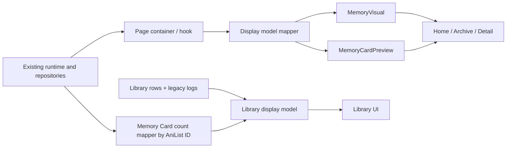

# Image-first UI Readiness Implementation Plan

> **For Codex:** REQUIRED SUB-SKILL: Use `superpowers:executing-plans` to implement this plan task-by-task. Use `superpowers:test-driven-development` for every behavior change, `react-doctor` before the final commit, and `superpowers:verification-before-completion` before claiming completion.

**Goal:** Make MOEMOA's Web-first experience feel like a deliberate, image-led private memory archive while preserving the current local-only Memory Card domain, catalog boundaries, and Android bridge behavior.

**Architecture:** Keep page containers responsible for runtime access and navigation, introduce display-only visual/preview components shared by Home, Archive, and Detail, and keep Composer state in its existing hook. Add a deterministic, isolated visual-test runner and a reviewed screenshot-baseline policy that does not weaken the catalog artifact guard.

**Tech Stack:** Astro 5, React 19, component-scoped CSS, IndexedDB/localStorage, Playwright 1.58, Node 24, existing catalog guard.

**Design source of truth:** `docs/superpowers/specs/2026-08-24-image-first-ui-readiness-design.md`

---

## 1. Purpose and user-visible result

This plan delivers the first coherent visual-readiness pass for the Web product. A new visitor should understand within ten seconds that MOEMOA is for saving private anime memories, and should be able to start a card without discovering a hidden menu. A returning visitor should see their archive, not a generic dashboard. Search results must make the distinction between adding a title to Library and creating a Memory Card obvious.

The finished slice has these visible outcomes:

- Home leads with an image-first Memory Archive story in both empty and returning states.
- The header exposes Create, Search, Library, and Archive without crowding 320px screens.
- Composer reads as one creative flow, keeps the visual preview prominent, and keeps the next required action visible.
- Archive behaves like a collection: one column at 320–359px, two at 360–767px, three at 768–1199px, and four at 1200px and above.
- Detail treats the visual as the primary artifact while editing, replacement, cleanup, and deletion remain explicit.
- Library membership, legacy quick logs, and Memory Card counts are visually and semantically separate.
- Empty, loading, offline/provider-unavailable, blocked save, saving, saved, error, missing image, cleanup-pending, and delete-confirm states are testable and readable.
- The four reference viewports—320×720, 390×844, 768×1024, and 1440×900—have no unintended horizontal overflow, clipping, inaccessible controls, or important action hidden by layout.

## 2. Decisions already made

These are implementation constraints, not open questions:

1. This is a Web-first pass. Android receives the result later through the existing Capacitor/Web boundary; this plan does not restart native UI work.
2. Memory Cards remain private and local-only. No upload, public sharing, Board, account sync, or cloud backup is added.
3. Library rows, legacy WatchLogs, and Memory Cards remain separate domain objects.
4. The page container may read a runtime; presentational components may not.
5. The design uses current system-design artwork and synthetic test media only. No catalog cover or user image is committed as a visual baseline.
6. New page rules live beside components. Do not add another screen-specific override layer to `src/styles/global.css`.
7. Chromium owns pixel baselines. Firefox and WebKit verify behavior and layout invariants only.
8. Eighteen Golden Screenshots are the review set. Other state/viewport combinations use DOM, accessibility, geometry, and overflow assertions.
9. Pixel comparison uses `maxDiffPixelRatio: 0.001`. Blanket masking and broad screenshot exclusions are prohibited.
10. A screenshot PNG may enter Git only through the exact reviewed visual-baseline directory and manifest policy described in Task 1.

## 3. Current state and evidence

### Repository evidence

- `src/styles/global.css` is over 6,300 lines and already contains repeated Home/navigation override layers.
- `TopNavDataMenu.jsx` has the required routes and a Card action, but mobile hierarchy and search prominence are inconsistent.
- `HomeEmptyState.jsx` and `HomeMemoryOverview.jsx` prove the right product direction but render as isolated utility surfaces rather than a memory-led composition.
- `MemoryCardComposer.jsx` is functionally correct but box-heavy; at mobile height the save path is not visually continuous.
- `ArchiveView.jsx` uses 16:10 cards but repeats archive calls to action and has a generic empty state.
- `MemoryCardDetail.jsx` keeps update, replacement, and delete behavior in one screen, but the visual hierarchy is form-first and delete still uses a browser dialog.
- `Library.jsx` labels legacy WatchLog count as memory state. It does not count real Memory Cards by AniList binding.
- `scripts/run-e2e.mjs` always targets port 4321 and reuses an existing process. This allowed an unrelated local Astro server and its dev toolbar into a prior visual audit.
- `tools/catalog-lab/cli.mjs` correctly blocks tracked PNG/JPEG/WebP artifacts except exact Android bootstrap resources. Visual snapshots therefore need a narrow reviewed policy rather than a directory-wide guard bypass.

### Visual audit evidence

The local audit in `D:\hong\Web\Anime\.moemoa-ui-audit` showed:

- excessive empty desktop space on Home,
- dense and fragmented Composer structure,
- important mobile actions falling below the initial reading flow,
- duplicate Archive empty-state actions,
- inconsistent visual weight between image, title, metadata, and system status,
- and contamination from a reused development server.

These audit files are evidence only and must not be committed.

## 4. Scope

### In scope

- Header/navigation/search hierarchy.
- Home empty and returning states.
- Composer information architecture and responsive layout.
- Archive empty/populated layouts and collection grid.
- Memory Card detail hierarchy, replacement state, and in-app delete confirmation.
- Library/WatchLog/Memory Card labeling and counts.
- Korean and English UI copy affected by the new hierarchy.
- Deterministic screenshot and layout test infrastructure.
- Exact manifest-bound visual snapshot allowance in the catalog guard.
- Accessibility, responsive, and visual-regression verification.

### Out of scope

- Database or Memory Card schema migration.
- Supabase writes, login, sync, backup, or public profiles.
- Production web image upload.
- Board/playlist/social sharing implementation.
- Catalog ingestion or canonical/projection changes.
- New third-party UI/animation libraries.
- Android Activity/bridge changes.
- Production deployment or push.

## 5. Architecture and data flow



### Display-only interfaces

`MemoryVisual` receives one of these objects and never opens a repository:

```js
{ kind: "SYSTEM_DESIGN", designSpec }
{ kind: "IMAGE", src, alt }
{ kind: "MISSING" }
```

`MemoryCardPreview` receives:

```js
{
  href,
  title,
  cue: "",
  dateLabel: "",
  badge: "",
  visual,
  variant: "grid" | "featured",
  systemCopy,
  missingLabel,
}
```

Home, Archive, and Detail adapt their existing runtime bundles into this shape. `MemoryCardPreview` and `MemoryVisual` do not call `getPlatformMemoryRuntime`, mutate state, or navigate imperatively.

### Library count boundary

Add a pure mapper that counts archived Memory Cards only when:

- `title.kind === "ANIME_REF"`,
- `title.sourceBinding.provider === "ANILIST"`, and
- `sourceBinding.externalId` is a safe positive integer string.

The result is a `Map<number, number>` keyed by AniList ID. The UI renders:

- Library membership/status,
- `Quick logs N` for legacy WatchLogs,
- `Memory cards N` for actual Memory Cards.

No count is inferred from a title string or fuzzy match.

### State ownership

- Composer continues to use `useMemoryCardComposer`.
- Home continues to use `useHomeMemoryArchive`.
- Archive and Detail continue to acquire the platform runtime at the page-container boundary.
- Existing ticket promotion, image replacement, deferred cleanup, and repository calls remain unchanged unless a test demonstrates a presentation-layer regression.

## 6. File map

### New files

- `src/features/memory/components/MemoryVisual.jsx`
- `src/features/memory/components/MemoryCardPreview.jsx`
- `src/features/memory/components/memory-visual.css`
- `src/features/memory/components/memory-card-preview.css`
- `src/features/memory/components/memory-card-counts.js`
- `src/components/top-nav-readiness.css`
- `src/components/home/home-readiness.css`
- `tests/unit/memoryCardCounts.test.mjs`
- `tests/unit/visualRunner.test.mjs`
- `tests/helpers/memoryVisualFixtures.ts`
- `tests/helpers/visualAssertions.ts`
- `tests/ui-readiness-functional.spec.ts`
- `tests/visual/ui-readiness.visual.spec.ts`
- `tests/visual/visual-baseline-manifest.json`
- `scripts/run-visual-e2e.mjs`
- `scripts/lib/isolatedE2eServer.mjs`
- `scripts/update-visual-baseline-manifest.mjs`
- `tools/catalog-lab/visual-baseline-policy.mjs`

### Existing files expected to change

- `package.json`
- `playwright.config.ts`
- `scripts/run-e2e.mjs`
- `tools/catalog-lab/cli.mjs`
- `tests/catalog-lab/runner-cli-report.test.mjs`
- `src/components/TopNavDataMenu.jsx`
- `src/components/search/TopNavGlobalSearch.jsx`
- `src/components/search/QuickActionPanel.jsx`
- `src/components/home/HomeEmptyState.jsx`
- `src/components/home/HomeMemoryOverview.jsx`
- `src/components/Home.jsx`
- `src/features/memory/components/MemoryRouteShell.jsx`
- `src/features/memory/components/MemoryCardComposer.jsx`
- `src/features/memory/components/memory-card-composer.css`
- `src/features/memory/components/ArchiveView.jsx`
- `src/features/memory/components/archive-view.css`
- `src/features/memory/components/MemoryCardDetail.jsx`
- `src/features/memory/components/MemoryImageReplacement.jsx`
- `src/features/memory/components/memory-card-detail.css`
- `src/components/Library.jsx`
- `src/components/library/LibraryUi.jsx`
- `src/components/library/LibraryDetailModal.jsx`
- `src/messages/en.js`
- `src/messages/ko.js`
- `tests/index.spec.ts`
- `tests/memory-card-composer.spec.ts`
- `tests/memory-card-discovery.spec.ts`
- `tests/page-design-system.spec.ts`
- `tests/layout-mobile.spec.ts`
- `tests/layout-desktop.spec.ts`
- `tests/library-userflow.spec.ts`
- `docs/moemoa/plans/first-private-vertical-slice.md`
- `docs/moemoa/reports/private-slice-test-evidence.md`

`src/styles/global.css` is not a destination for new UI-readiness rules. Removing a proven-dead legacy selector is allowed only in the task that replaces it, with focused regression coverage.

## 7. Data and migration strategy

There is no persistent-data migration.

- Existing IndexedDB Memory Cards remain readable.
- Existing `SYSTEM_DESIGN`, `IMAGE`, and missing-image records map into the new display union.
- Existing Library and WatchLog localStorage keys remain unchanged.
- The new card-count mapper derives a view only; it does not write counts back to storage.
- Screenshot manifests are test metadata, not product or catalog data.

## 8. Milestones and task-by-task implementation

### Task 1: Deterministic visual runner and guarded screenshot baseline policy

**Files:**

- Create: `scripts/run-visual-e2e.mjs`
- Create: `scripts/lib/isolatedE2eServer.mjs`
- Create: `scripts/update-visual-baseline-manifest.mjs`
- Create: `tools/catalog-lab/visual-baseline-policy.mjs`
- Create: `tests/visual/visual-baseline-manifest.json`
- Create: `tests/visual/ui-readiness.visual.spec.ts` (Task 1 infrastructure smoke; Task 8 expands this into the reviewed matrix)
- Modify: `scripts/run-e2e.mjs`
- Modify: `playwright.config.ts`
- Modify: `package.json`
- Modify: `tools/catalog-lab/cli.mjs`
- Test: `tests/catalog-lab/runner-cli-report.test.mjs`
- Test: `tests/ui-readiness-functional.spec.ts`
- Test: `tests/unit/visualRunner.test.mjs`

**Step 1: Write failing tests**

Add catalog-guard cases proving:

1. an unmanifested PNG under `tests/visual/**-snapshots/` is blocked,
2. a manifest entry with a mismatched checksum is blocked,
3. a traversal, duplicate, non-PNG, missing-file, or extra-file entry is blocked,
4. an exact PNG with safe relative path, declared dimensions, byte size, and SHA-256 is allowed,
5. PNGs anywhere else remain blocked.

Add a dependency-injected runner unit test that starts a sentinel server on 4321, chooses another loopback port, and proves the owned child is terminated on success, Playwright failure, and interrupt. The focused E2E smoke then proves that the rendered page has no Astro toolbar.

Run:

```powershell
npm.cmd run catalog:test
npm.cmd run test:unit
node scripts/run-visual-e2e.mjs tests/ui-readiness-functional.spec.ts --project=chromium --workers=1
```

Expected RED: the guard blocks the valid declared baseline because no policy exists, and the visual runner/script is missing.

**Step 2: Implement the smallest safe policy**

`visual-baseline-policy.mjs` must:

- accept only normalized paths under `tests/visual/*-snapshots/`,
- reject absolute paths, drive letters, `..`, backslashes, duplicates, symlinks, and extensions other than `.png`,
- require a versioned manifest entry with exact SHA-256, byte size, width, and height,
- parse PNG signature/IHDR itself and reject malformed dimensions,
- cap individual baselines and total baseline bytes,
- require one-to-one correspondence between manifest entries and baseline files,
- return a narrow allow/deny decision without reading catalog workspaces.

Integrate that decision before `leakedArtifact`; do not add a directory skip:

```js
if (await isApprovedVisualBaseline({ repoRoot, relativePath: rel, manifest })) {
  continue;
}
if (await leakedArtifact(path, rel)) leaks.push(rel);
```

The manifest updater may write only the manifest and only after `--update-snapshots` has produced exact PNGs. It must refuse images outside the baseline directory. The manifest records `assetClass: "TEST_UI_SCREENSHOT"` and a scenario name so code review exposes every baseline change.

`run-visual-e2e.mjs` must use `isolatedE2eServer.mjs` to claim a fresh available loopback port, set `PLAYWRIGHT_BASE_URL`, own and terminate its Astro child, set `CI=1`, and refuse to reuse another server. Child termination must be covered for normal exit, test failure, and `SIGINT`/`SIGTERM`. General `run-e2e.mjs` should honor `PLAYWRIGHT_BASE_URL` without changing its default behavior.

Add scripts:

```json
"test:e2e:visual": "node scripts/run-visual-e2e.mjs tests/visual/ui-readiness.visual.spec.ts --project=chromium --workers=1",
"test:e2e:visual:update": "node scripts/run-visual-e2e.mjs tests/visual/ui-readiness.visual.spec.ts --project=chromium --workers=1 --update-snapshots",
"test:e2e:visual:manifest": "node scripts/update-visual-baseline-manifest.mjs"
```

**Step 3: Verify GREEN**

Run the two focused commands, then:

```powershell
npm.cmd run catalog:guard
git diff --check
```

Expected GREEN: exact approved synthetic screenshot fixture allowed; all adversarial fixtures blocked; isolated runner uses its own port and leaves no child running.

**Step 4: Commit**

```powershell
git add package.json playwright.config.ts scripts/run-e2e.mjs scripts/run-visual-e2e.mjs scripts/lib/isolatedE2eServer.mjs scripts/update-visual-baseline-manifest.mjs tools/catalog-lab/cli.mjs tools/catalog-lab/visual-baseline-policy.mjs tests/catalog-lab/runner-cli-report.test.mjs tests/ui-readiness-functional.spec.ts tests/unit/visualRunner.test.mjs tests/visual/ui-readiness.visual.spec.ts tests/visual/visual-baseline-manifest.json
git commit -m "test(ui): isolate reviewed visual baselines"
```

### Task 2: Shared memory visual language and display components

**Files:**

- Create: `src/features/memory/components/MemoryVisual.jsx`
- Create: `src/features/memory/components/MemoryCardPreview.jsx`
- Create: `src/features/memory/components/memory-visual.css`
- Create: `src/features/memory/components/memory-card-preview.css`
- Modify: `src/features/memory/components/SystemDesignPreview.jsx`
- Modify: `src/features/memory/components/system-design-preview.css`
- Test: `tests/ui-readiness-functional.spec.ts`
- Test: `tests/page-design-system.spec.ts`

**Step 1: Write failing component-boundary and geometry tests**

Cover all three visual kinds, both preview variants, text overflow, missing-image status, correct link name, 4:5 grid crop stability, and contained full visual in Detail. Assert that display components do not expose save/delete controls and do not access a global runtime seam.

Run:

```powershell
node scripts/run-visual-e2e.mjs tests/ui-readiness-functional.spec.ts tests/page-design-system.spec.ts --project=chromium --workers=1
```

Expected RED: the new component roles/classes are absent.

**Step 2: Implement display-only components**

Use semantic markup:

```jsx
<article className={`memory-preview memory-preview--${variant}`}>
  <MemoryVisual visual={visual} systemCopy={systemCopy} missingLabel={missingLabel} />
  <div className="memory-preview__body">…</div>
</article>
```

Rules:

- `MemoryVisual` contains image/system/missing rendering only.
- Image `alt` describes the saved memory, not its storage mechanics.
- `SYSTEM_DESIGN` remains visually branded but has the same aspect frame as an image.
- Text uses line clamping only where the complete title remains available to assistive technology.
- Focus, reduced motion, contrast, and forced-colors behavior are explicit.
- Shared tokens are local CSS custom properties on `.memory-visual-scope`, not additions to `global.css`.

**Step 3: Verify and commit**

```powershell
node scripts/run-visual-e2e.mjs tests/ui-readiness-functional.spec.ts tests/page-design-system.spec.ts --project=chromium --workers=1
npm.cmd run test:unit
git diff --check
git add src/features/memory/components/MemoryVisual.jsx src/features/memory/components/MemoryCardPreview.jsx src/features/memory/components/memory-visual.css src/features/memory/components/memory-card-preview.css src/features/memory/components/SystemDesignPreview.jsx src/features/memory/components/system-design-preview.css tests/ui-readiness-functional.spec.ts tests/page-design-system.spec.ts
git commit -m "feat(ui): add shared memory visual components"
```

### Task 3: Clarify header, global search, and action hierarchy

**Files:**

- Create: `src/components/top-nav-readiness.css`
- Modify: `src/components/TopNavDataMenu.jsx`
- Modify: `src/components/search/TopNavGlobalSearch.jsx`
- Modify: `src/components/search/QuickActionPanel.jsx`
- Modify: `src/messages/en.js`
- Modify: `src/messages/ko.js`
- Test: `tests/index.spec.ts`
- Test: `tests/memory-card-discovery.spec.ts`
- Test: `tests/layout-mobile.spec.ts`

**Step 1: Write failing navigation/discovery tests**

Assert at 320px and desktop:

- Create remains visible without opening overflow.
- Search is reachable with an accessible name and never overlaps locale/menu controls.
- Current route is conveyed with `aria-current`.
- Search result rows have one visually primary `Create memory` action and a distinct secondary `Add to Library` action.
- Activating `Add to Library` never opens a Memory detail/draft and creates no Memory Card.
- Escape closes overlays and focus returns to the invoking control.
- All primary controls are at least 44×44 CSS px; remaining non-inline targets satisfy 24×24 or spacing.

Run:

```powershell
node scripts/run-visual-e2e.mjs tests/index.spec.ts tests/memory-card-discovery.spec.ts tests/layout-mobile.spec.ts --project=chromium --workers=1
```

Expected RED: the new hierarchy, focus-return, and geometry assertions fail.

**Step 2: Implement the header and row hierarchy**

- Keep Home, Library, Archive, and Create in the first-level information architecture.
- Move lower-frequency Tier/data/locale controls into the secondary menu at narrow widths.
- Give search a stable labelled control rather than relying on icon recognition.
- Use row grouping and copy to state the different effects of Create and Add to Library.
- Preserve the existing exact `AnimeRef` handoff and library-only mutation paths.
- Import `top-nav-readiness.css` from the component and remove only selectors that are proven obsolete by the focused tests.

**Step 3: Verify and commit**

```powershell
node scripts/run-visual-e2e.mjs tests/index.spec.ts tests/memory-card-discovery.spec.ts tests/layout-mobile.spec.ts --project=chromium --workers=1
npm.cmd run test:unit
git diff --check
git add src/components/top-nav-readiness.css src/components/TopNavDataMenu.jsx src/components/search/TopNavGlobalSearch.jsx src/components/search/QuickActionPanel.jsx src/messages/en.js src/messages/ko.js tests/index.spec.ts tests/memory-card-discovery.spec.ts tests/layout-mobile.spec.ts
git commit -m "feat(ui): clarify create and library actions"
```

### Task 4: Recompose Home as the Memory Archive entry point

**Files:**

- Create: `src/components/home/home-readiness.css`
- Modify: `src/components/Home.jsx`
- Modify: `src/components/home/HomeEmptyState.jsx`
- Modify: `src/components/home/HomeMemoryOverview.jsx`
- Modify: `src/messages/en.js`
- Modify: `src/messages/ko.js`
- Test: `tests/index.spec.ts`
- Test: `tests/layout-desktop.spec.ts`
- Test: `tests/layout-mobile.spec.ts`
- Test: `tests/ui-readiness-functional.spec.ts`

**Step 1: Write failing state and layout tests**

Empty Home must expose, in order:

1. a concise private-memory promise,
2. an image-led system-design specimen,
3. primary Create action,
4. secondary Search/Add title path,
5. plain-language local-only note.

Returning Home must expose the latest real Memory Card using `MemoryCardPreview`, archive count, Open Archive, and Create another memory. Loading and repository error states must reserve stable space and not misrepresent an empty archive.

Assert 320/390/768/1440 geometry, `max-width: 1200px`, readable copy width no more than 680px, and no viewport overflow. Also assert the primary CTA is fully visible in the first Home viewport.

Expected RED command:

```powershell
node scripts/run-visual-e2e.mjs tests/index.spec.ts tests/layout-desktop.spec.ts tests/layout-mobile.spec.ts tests/ui-readiness-functional.spec.ts --project=chromium --workers=1
```

**Step 2: Implement the two Home compositions**

- Empty state uses a quiet two-column editorial layout on desktop and a single visual-first flow on mobile.
- Returning state makes the latest card the largest surface; utility statistics remain subordinate.
- Replace ad-hoc preview markup with `MemoryCardPreview`.
- Keep loading, empty, and error copy mutually exclusive.
- Do not add dashboards, decorative fake data, or unrelated product promises.

**Step 3: Verify and commit**

```powershell
node scripts/run-visual-e2e.mjs tests/index.spec.ts tests/layout-desktop.spec.ts tests/layout-mobile.spec.ts tests/ui-readiness-functional.spec.ts --project=chromium --workers=1
npm.cmd run test:unit
git diff --check
git add src/components/home/home-readiness.css src/components/Home.jsx src/components/home/HomeEmptyState.jsx src/components/home/HomeMemoryOverview.jsx src/messages/en.js src/messages/ko.js tests/index.spec.ts tests/layout-desktop.spec.ts tests/layout-mobile.spec.ts tests/ui-readiness-functional.spec.ts
git commit -m "feat(ui): make Home a memory-led entry point"
```

### Task 5: Turn Composer into one clear creative flow

**Files:**

- Modify: `src/features/memory/components/MemoryRouteShell.jsx`
- Modify: `src/features/memory/components/MemoryCardComposer.jsx`
- Modify: `src/features/memory/components/MemoryTitleSelector.jsx`
- Modify: `src/features/memory/components/memory-card-composer.css`
- Modify: `src/messages/en.js`
- Modify: `src/messages/ko.js`
- Test: `tests/memory-card-composer.spec.ts`
- Test: `tests/ui-readiness-functional.spec.ts`
- Test: `tests/layout-mobile.spec.ts`

**Step 1: Write failing flow tests**

Assert:

- visual preview is first in the reading order on mobile and remains visible beside the form on desktop,
- title, image/system-design choice, reflection, rights acknowledgement, and Save have an obvious progression,
- Save is disabled with an adjacent actionable reason rather than color alone,
- saving/saved/error states are announced through a live region without changing domain behavior,
- browser-only image intake explains Android availability without exposing a fake file picker,
- prepared tickets are claimed once across locale changes,
- double submit creates one card,
- a catalog-bound card retains the exact `AnimeRef`,
- a typical system-design card can be completed in under two minutes in the human gate.

Run:

```powershell
node scripts/run-visual-e2e.mjs tests/memory-card-composer.spec.ts tests/ui-readiness-functional.spec.ts tests/layout-mobile.spec.ts --project=chromium --workers=1
```

Expected RED: new reading-order, blocked-save explanation, and responsive layout assertions fail.

**Step 2: Recompose without changing the application boundary**

- Keep `useMemoryCardComposer` as the single state owner.
- Render the preview and creative choices as one composition, not multiple nested cards.
- On desktop use a stable preview column and a form column; on mobile use visual → title → reflection → rights → Save.
- Use an in-flow/sticky action region only when it does not cover content or the mobile keyboard.
- Enable the desktop visual sticky treatment only when height is sufficient; explicitly fall back to document flow at 1024×768 and other viewports at or below 800px high.
- Preserve all current claim, discard, promote, save, and error paths.
- Keep local-only and rights copy next to the choice it qualifies.

**Step 3: Verify and commit**

```powershell
node scripts/run-visual-e2e.mjs tests/memory-card-composer.spec.ts tests/ui-readiness-functional.spec.ts tests/layout-mobile.spec.ts --project=chromium --workers=1
npm.cmd run test:unit
git diff --check
git add src/features/memory/components/MemoryRouteShell.jsx src/features/memory/components/MemoryCardComposer.jsx src/features/memory/components/MemoryTitleSelector.jsx src/features/memory/components/memory-card-composer.css src/messages/en.js src/messages/ko.js tests/memory-card-composer.spec.ts tests/ui-readiness-functional.spec.ts tests/layout-mobile.spec.ts
git commit -m "feat(ui): streamline memory card creation"
```

### Task 6: Make Archive a responsive collectible gallery

**Files:**

- Modify: `src/features/memory/components/ArchiveView.jsx`
- Modify: `src/features/memory/components/archive-view.css`
- Modify: `src/messages/en.js`
- Modify: `src/messages/ko.js`
- Test: `tests/memory-card-composer.spec.ts`
- Test: `tests/ui-readiness-functional.spec.ts`
- Test: `tests/layout-mobile.spec.ts`
- Test: `tests/layout-desktop.spec.ts`

**Step 1: Write failing archive tests**

Cover:

- empty, loading, repository error, populated, and missing-image cards,
- card grid columns of 1/2/3/4 at the approved breakpoints,
- a 4:5 thumbnail frame and a card content width of at least 148px; if that minimum cannot be maintained, use one fewer column,
- title/cue/date/badge hierarchy and full accessible link names,
- deterministic ordering from the existing repository result,
- one Create action rather than duplicate competing calls to action,
- keyboard traversal and visible focus,
- no stretched artwork or cumulative layout shift.

Run:

```powershell
node scripts/run-visual-e2e.mjs tests/memory-card-composer.spec.ts tests/ui-readiness-functional.spec.ts tests/layout-mobile.spec.ts tests/layout-desktop.spec.ts --project=chromium --workers=1
```

Expected RED: the breakpoint and state-specific assertions fail.

**Step 2: Implement the collection view**

- Replace card-specific markup with `MemoryCardPreview variant="grid"`.
- Use CSS Grid with the exact approved breakpoints.
- Make the page heading/description compact and let the archive own the visual field.
- Keep missing images visibly recoverable rather than rendering a broken asset.
- Do not add filter/sort functionality in this pass; reserve no fake controls for it.

**Step 3: Verify and commit**

```powershell
node scripts/run-visual-e2e.mjs tests/memory-card-composer.spec.ts tests/ui-readiness-functional.spec.ts tests/layout-mobile.spec.ts tests/layout-desktop.spec.ts --project=chromium --workers=1
npm.cmd run test:unit
git diff --check
git add src/features/memory/components/ArchiveView.jsx src/features/memory/components/archive-view.css src/messages/en.js src/messages/ko.js tests/memory-card-composer.spec.ts tests/ui-readiness-functional.spec.ts tests/layout-mobile.spec.ts tests/layout-desktop.spec.ts
git commit -m "feat(ui): present Archive as a memory gallery"
```

### Task 7: Refine Detail and separate Library, logs, and Memory Cards

**Files:**

- Create: `src/features/memory/components/memory-card-counts.js`
- Create: `tests/unit/memoryCardCounts.test.mjs`
- Modify: `src/features/memory/components/MemoryCardDetail.jsx`
- Modify: `src/features/memory/components/MemoryImageReplacement.jsx`
- Modify: `src/features/memory/components/memory-card-detail.css`
- Modify: `src/components/Library.jsx`
- Modify: `src/components/library/LibraryUi.jsx`
- Modify: `src/components/library/LibraryDetailModal.jsx`
- Modify: `src/messages/en.js`
- Modify: `src/messages/ko.js`
- Test: `tests/memory-card-composer.spec.ts`
- Test: `tests/library-userflow.spec.ts`
- Test: `tests/ui-readiness-functional.spec.ts`

**Step 1: Write failing unit and E2E tests**

Unit cases for the count mapper:

- counts exact AniList bindings,
- aggregates multiple Memory Cards for one title,
- ignores custom titles, other providers, invalid IDs, and malformed records,
- does not mutate input.

E2E cases:

- Detail renders `MemoryVisual` before edit utilities.
- Missing image and cleanup-pending are distinct, actionable states.
- Replacement keeps the old asset until the new asset is committed and preserves current cleanup ownership semantics.
- Delete opens an in-app accessible confirmation; Cancel restores focus and does not delete; Confirm deletes once.
- Library displays membership/status, Quick logs, and Memory cards as separate facts.
- `Add to Library` increments none of the Memory Card counts.
- Creating an AnimeRef Memory Card increments only the matching title's Memory Card count.

Run:

```powershell
npm.cmd run test:unit
node scripts/run-visual-e2e.mjs tests/memory-card-composer.spec.ts tests/library-userflow.spec.ts tests/ui-readiness-functional.spec.ts --project=chromium --workers=1
```

Expected RED: mapper is missing, Detail lacks in-app confirmation, and Library has no real Memory Card count.

**Step 2: Implement pure counting and presentation changes**

Pure mapper outline:

```js
export function buildMemoryCardCountsByAniListId(archive) {
  const counts = new Map();
  for (const bundle of Array.isArray(archive) ? archive : []) {
    const binding = bundle?.title?.sourceBinding;
    if (bundle?.title?.kind !== "ANIME_REF" || binding?.provider !== "ANILIST") continue;
    const id = Number(binding.externalId);
    if (!Number.isSafeInteger(id) || id <= 0 || String(id) !== binding.externalId) continue;
    counts.set(id, (counts.get(id) ?? 0) + 1);
  }
  return counts;
}
```

The production implementation should accept canonical numeric strings without coercion ambiguity and freeze/avoid mutating inputs as existing conventions require.

- Detail reuses `MemoryVisual` but keeps editing controls in the page container.
- Replace `window.confirm` with an accessible dialog controlled by local UI state.
- Do not alter repository/application deletion or cleanup operations.
- Library loads the archive through the existing runtime boundary and derives counts. Loading failure shows Memory count unavailable; it must not silently claim zero.

**Step 3: Verify and commit**

```powershell
npm.cmd run test:unit
node scripts/run-visual-e2e.mjs tests/memory-card-composer.spec.ts tests/library-userflow.spec.ts tests/ui-readiness-functional.spec.ts --project=chromium --workers=1
git diff --check
git add src/features/memory/components/memory-card-counts.js tests/unit/memoryCardCounts.test.mjs src/features/memory/components/MemoryCardDetail.jsx src/features/memory/components/MemoryImageReplacement.jsx src/features/memory/components/memory-card-detail.css src/components/Library.jsx src/components/library/LibraryUi.jsx src/components/library/LibraryDetailModal.jsx src/messages/en.js src/messages/ko.js tests/memory-card-composer.spec.ts tests/library-userflow.spec.ts tests/ui-readiness-functional.spec.ts
git commit -m "feat(ui): distinguish library logs and memory cards"
```

### Task 8: Golden Screenshots, cross-browser verification, human gate, and document sync

**Files:**

- Create: `tests/helpers/memoryVisualFixtures.ts`
- Create: `tests/helpers/visualAssertions.ts`
- Create: `tests/visual/ui-readiness.visual.spec.ts`
- Create/update: `tests/visual/ui-readiness.visual.spec.ts-snapshots/*.png`
- Update: `tests/visual/visual-baseline-manifest.json`
- Modify: `tests/ui-readiness-functional.spec.ts`
- Modify: `docs/moemoa/plans/first-private-vertical-slice.md`
- Modify: `docs/moemoa/reports/private-slice-test-evidence.md`

**Step 1: Build deterministic fixtures before snapshots**

Fixtures must:

- clear localStorage and relevant IndexedDB stores,
- set one locale explicitly,
- seed Memory Cards through the real composer/runtime path or existing DEV-only test seams,
- use `SYSTEM_DESIGN` or a synthetic project-owned data URL only,
- never call AniList, Supabase, or external image hosts,
- disable animation/caret nondeterminism through reduced-motion and stable clock data,
- wait for fonts, images, repository loading, and overlay closure before capture.

Add `assertNoHorizontalOverflow`, target-size assertions, focus-visible assertions, and stable-content helpers.

**Step 2: Add exactly the approved 18 Chromium Golden Screenshots**

| Screen | Approved Golden state | Count |
|---|---|---:|
| Navigation/search | 320 EN dark compact search; 1440 KO light desktop search result | 2 |
| Home | 390 EN dark empty; 1440 KO light empty; 390 KO dark active; 1440 EN dark active | 4 |
| Composer | 320 EN dark empty; 390 KO light system-design selected; 1440 EN dark title selected; 1440 KO dark save error | 4 |
| Archive | 320 KO dark empty; 390 EN dark populated; 1440 KO light populated | 3 |
| Detail | 390 EN dark READY; 320 KO dark MISSING; 1440 KO light READY | 3 |
| Library/Memory split | 390 EN dark search actions; 1440 KO light added-to-Library status | 2 |
| **Total** |  | **18** |

Every assertion uses:

```ts
await expect(page).toHaveScreenshot(name, {
  animations: "disabled",
  caret: "hide",
  maxDiffPixelRatio: 0.001,
});
```

No broad masks. A narrowly dynamic browser artifact must be eliminated at the fixture/runner level, not hidden in the screenshot.

Generate candidate baselines:

```powershell
npm.cmd run test:e2e:visual:update
npm.cmd run test:e2e:visual:manifest
npm.cmd run catalog:guard
```

Expected first RED before reviewed updates: existing/missing baselines fail. Inspect all 18 candidate images at 100% and fit-to-window before accepting the manifest update.

**Step 3: Run functional state matrix across browsers**

Chromium, Firefox, and WebKit must pass behavior/layout assertions for:

- empty/loading/error,
- offline and provider unavailable,
- save blocked/saving/saved/error,
- image missing and cleanup pending,
- delete cancel/confirm,
- 320/390/768/1440 overflow and grid rules,
- additional 360×800, 412×915, 1024×768, and 1280×720 overflow/primary-action rules,
- 200% browser zoom / 320 CSS px reflow without functional loss or two-axis page scrolling,
- dark and light theme contrast/hierarchy, reduced motion, one `main`, one clear `h1`, valid heading order, associated form errors, and appropriate `status`/`alert` roles,
- featured visual/form layout stability before and after fonts/images settle,
- keyboard navigation and focus restoration,
- Korean and English long-copy clipping.

Run:

```powershell
npm.cmd run test:e2e:visual
node scripts/run-visual-e2e.mjs tests/ui-readiness-functional.spec.ts --project=chromium --project=firefox --project=webkit --workers=1
```

Firefox/WebKit do not compare pixels.

**Step 4: Perform the human acceptance gate**

Record pass/fail evidence for the exact nine checks in the design spec:

1. Without explanation, the tester points to the Memory Card creation entry within ten seconds.
2. The tester explains the result difference between `Create card` and `Add to Library`.
3. The tester completes search → visual choice → short memory → save → Home/Archive → Detail without interruption.
4. The tester approves no clipping, overlap, excessive empty space, or unreadable contrast at 320×720, 390×844, and 1440×900.
5. The tester approves equivalent meaning and action hierarchy in Korean and English.
6. Without explanation, the tester saves the first Complete Card within two minutes and finds it immediately in Archive.
7. The tester explains why an image is useful and that system design is the alternative.
8. The tester does not interpret `PRIVATE · LOCAL ONLY` as public posting or cloud backup.
9. In Detail, the tester explains the different results of note editing, visual replacement, and card deletion.

This is an internal readiness gate, not external analytics collection. Do not add telemetry.

**Step 5: Run the full final verification ladder**

```powershell
npm.cmd run test:unit
npm.cmd run catalog:test
npm.cmd run test:e2e:visual
npm.cmd run test:e2e
npm.cmd run build
npm.cmd run catalog:guard
npx.cmd --yes react-doctor@latest . --verbose
git diff --check
git status --short
```

If `npx` would require network or introduce an unreviewed version, use the installed `react-doctor` skill/runtime command instead and record the exact result. A Vite size warning is not automatically acceptable: compare it to baseline and investigate any regression.

**Step 6: Synchronize documents and commit**

Update `first-private-vertical-slice.md` and `private-slice-test-evidence.md` with:

- implemented scope,
- exact test results,
- 18-baseline inventory,
- human-gate result,
- unresolved findings,
- and the next recommended product slice.

Commit product and test evidence only after all checks pass:

```powershell
git add tests/helpers/memoryVisualFixtures.ts tests/helpers/visualAssertions.ts tests/visual/ui-readiness.visual.spec.ts tests/visual/ui-readiness.visual.spec.ts-snapshots tests/visual/visual-baseline-manifest.json tests/ui-readiness-functional.spec.ts docs/moemoa/plans/first-private-vertical-slice.md docs/moemoa/reports/private-slice-test-evidence.md
git commit -m "test(ui): lock visual readiness baseline"
```

Do not push, merge, deploy, or copy the test catalog into the repository without a separate user instruction.

## 9. Test strategy and acceptance criteria

### Automated layers

1. **Pure unit tests:** Memory Card count mapping and any extracted display-model helpers.
2. **Focused Chromium E2E:** interaction, state, geometry, accessibility names, focus management.
3. **Chromium visual regression:** exactly 18 reviewed baselines at `0.001` maximum pixel difference.
4. **Firefox/WebKit functional regression:** no pixel comparison; behavior, overflow, layout bands, and keyboard use.
5. **Existing full regression:** unit, catalog, full E2E, build, and catalog guard.
6. **React Doctor:** no score regression; new actionable findings are fixed or documented before completion.

### Acceptance criteria

- All four reference viewports have `document.documentElement.scrollWidth <= window.innerWidth` except an intentionally scrollable element explicitly asserted in its own container.
- Primary mobile controls are at least 44×44 CSS px.
- Normal text contrast is at least 4.5:1; large text, focus, and control boundaries at least 3:1.
- Focus does not disappear under sticky content, dialogs, or overlays.
- Archive grid matches 1/2/3/4 columns at approved bands.
- Search actions preserve exact domain effects.
- Dark/light themes, Korean/English layouts, reduced motion, and 200% zoom retain meaning and operation.
- Existing image ticket/cleanup and local repository tests remain green.
- No external request is required for visual or functional fixtures.
- `catalog:guard` permits only exact manifest-bound UI screenshots and still rejects all adversarial image/raw-record cases.

## 10. Security, privacy, and rights

- Visual fixtures may use system-generated artwork and synthetic project-owned pixels only.
- No AniList/AniLife cover, user capture, fan art, raw catalog record, absolute local path, secret, or Supabase credential may enter a screenshot or manifest.
- The baseline allow policy is file-by-file, checksum-bound, dimension-bound, and one-to-one; there is no `tests/visual/**` guard exemption.
- The isolated test runner binds only loopback and must terminate its child process.
- Existing production image intake remains Android-only and local-only.
- Rights acknowledgement remains explicit for user-provided imagery.
- Error messages and test output must not expose absolute user paths or private image content.

## 11. Observability and diagnostics

No product analytics are added in this slice. Diagnostics are test-owned:

- visual failures produce Playwright expected/actual/diff artifacts outside tracked source,
- functional failures identify state and viewport in test names,
- isolated runner logs its chosen loopback port and child exit classification without secrets,
- baseline-manifest validation reports relative paths and reason codes only,
- UI error states use existing typed application/runtime errors and user-safe copy.

## 12. Rollback and recovery

- Each task ends in a focused commit so visual infrastructure, shared primitives, and individual screens can be reverted separately.
- No storage migration means rollback does not rewrite user data.
- If a page change fails cross-browser verification, revert only that page task and retain Task 1's test infrastructure.
- If screenshot policy introduces a catalog-guard regression, fail closed: remove proposed baseline PNGs and revert the allow-policy commit. Do not bypass the guard.
- If a screenshot update is unintended, restore the previous PNG and manifest entry together; never hand-edit only the hash.
- Preserve the untracked user-owned `debug.log` throughout execution.

## 13. Risks and mitigations

| Risk | Mitigation |
|---|---|
| Existing global CSS overrides new component rules | Use scoped component roots, remove only proven-obsolete selectors, test computed geometry at four widths. |
| Visual snapshots become noisy | Isolated server, fixed fixtures, stable time, font/image waits, reduced motion, Chromium-only pixels. |
| Screenshot allowance weakens catalog protections | Exact safe path + manifest + SHA/size/dimensions + one-to-one inventory; adversarial guard tests; no directory skip. |
| Shared preview refactor breaks local image cleanup | Keep display components read-only; retain application/runtime tests; do not move cleanup ownership. |
| Library count conflates title strings | Count only exact AniList source bindings; no fuzzy/title matching. |
| Mobile sticky action covers fields/keyboard | Geometry tests at 320×720 and 390×844; prefer in-flow fallback when viewport height is constrained. |
| Reference-service imitation dilutes product identity | Use references only for hierarchy patterns; retain MOEMOA copy, system design, and local-memory model. |
| Scope grows into sync/social/filter features | No placeholders or fake controls; defer those features explicitly. |

## 14. User decisions

Resolved:

- Web-first before renewed Android implementation.
- Image-first Memory archive direction.
- Strong visual validation against good commercial patterns.
- Four reference viewports and 18 Golden Screenshots.
- Private/local-only behavior for this slice.
- Final deployment remains on hold.

No blocking user decision remains for implementation. Push, merge, deployment, and any use of external user testing require separate authorization.

## 15. Progress

- [x] Product direction and service principles reviewed.
- [x] Current UI rendered and visually audited.
- [x] Reference patterns reviewed from AniList, Letterboxd, and Pinterest.
- [x] Image-first design specification approved and refined.
- [x] Detailed implementation plan written.
- [x] Task 1: deterministic visual runner and guard policy.
- [x] Task 2: shared memory visual components.
- [x] Task 3: header/search hierarchy.
- [x] Task 4: Home composition.
- [x] Task 5: Composer composition.
- [ ] Task 6: Archive gallery.
- [ ] Task 7: Detail and Library distinction.
- [ ] Task 8: visual/cross-browser/human gate and document sync.

## 16. Discoveries and plan changes

- A prior visual audit accidentally reused a server on port 4321. The plan therefore requires a separately owned visual server rather than relying on Playwright's normal development-server reuse.
- The catalog guard deliberately blocks tracked image signatures. The plan adds a checksum-bound reviewed baseline mechanism instead of weakening or excluding the visual-test directory.
- The existing Library “memory” indicator is derived from WatchLogs. The plan introduces an exact AnimeRef-bound Memory Card count and relabels legacy logs.
- Pixel baselines across three browser engines would create platform noise without improving behavior confidence. Chromium owns pixels; Firefox/WebKit retain functional/layout coverage.
- 2026-08-24: the owned visual server readiness probe also needed a per-request timeout; a TCP connection that never returned HTTP could otherwise stall the runner indefinitely.
- 2026-08-24: Playwright reports inside the repository caused Astro's watcher to observe transient output. Visual-test reports now use the untracked sibling directory `.moemoa-ui-test-results` outside the repository.
- 2026-08-24: Task 1 keeps an empty, valid baseline manifest and a no-screenshot infrastructure smoke. Task 8 remains the only step allowed to create and review the 18 pixel baselines.
- 2026-08-24: one full catalog verification initially hit the pre-existing intermittent Chromium image-decode startup timeout; its isolated rerun and the next full rerun passed, so no unrelated cover-pipeline change was made.
- 2026-08-24: direct mobile visual inspection exposed a cascade conflict between the generic Composer preview class and `SystemDesignPreview`; a real-page regression now locks the vertical 4:5 composition and child containment.
- 2026-08-24: display-component tests preload React's client renderer because a clean Vite cache may optimize that dependency and reload once on first import; the product components retain no test-only route or runtime seam.
- 2026-08-24: Task 3's 320px header check passed, while an exploratory all-route 320px run exposed 24px of pre-existing `/data/` overflow. The header task keeps the established 360/390 all-route matrix; Task 8's explicit 320px reflow gate must resolve and lock the Data page separately.
- 2026-08-24: direct 320px browser inspection confirmed that the four primary header controls remain legible and separate, the search sheet fits without horizontal clipping, and Escape returns focus to the invoking search or menu control.
- 2026-08-24: Task 4 now keys the top-level Home composition to the real private Memory Archive: no card shows one visual-first starting promise, a real card shows the latest `MemoryCardPreview`, and loading/error states no longer render an empty-archive claim.
- 2026-08-24: direct desktop inspection refined the Korean specimen title to avoid a mid-word line break; automated 320/390/768/1440 rendering keeps the primary Create action in the first viewport with no horizontal overflow.
- 2026-08-24: a running process on port 4321 proved that general `run-e2e.mjs` can violate visual-test isolation. Task 3-8 verification commands now use the Task 1 `run-visual-e2e.mjs` owner/cleanup path.
- 2026-08-24: Task 5 now presents one ordered creative flow: visual → title → reflection → rights → Save. The disabled Save control exposes the next actionable requirement in adjacent text, while image errors remain a single assertive announcement.
- 2026-08-24: the Composer keeps its preview beside the fields above 900px, but makes it sticky only when the viewport is taller than 800px; automated 320px and 1024×768 checks lock the mobile reading order and compact-height fallback.
- 2026-08-24: a clean Vite dependency optimization can reload the isolated display fixture after its initial preload. The fixture retries only that classified execution-context reload once; product runtime behavior remains unchanged.

Add dated entries here during execution whenever evidence changes scope, sequencing, or an acceptance criterion.

## 17. Completion report template

At completion, append:

```md
### Completion report — YYYY-MM-DD

- Commits:
- Implemented tasks:
- Unit:
- Catalog:
- Chromium focused:
- Golden Screenshots:
- Firefox/WebKit:
- Build:
- Catalog guard:
- React Doctor:
- Human acceptance gate:
- Known issues:
- Recommended next slice:
- Push/deploy status: not performed
```

Implementation is complete only when this report is evidence-backed, all blocking checks pass, and no required task remains.
